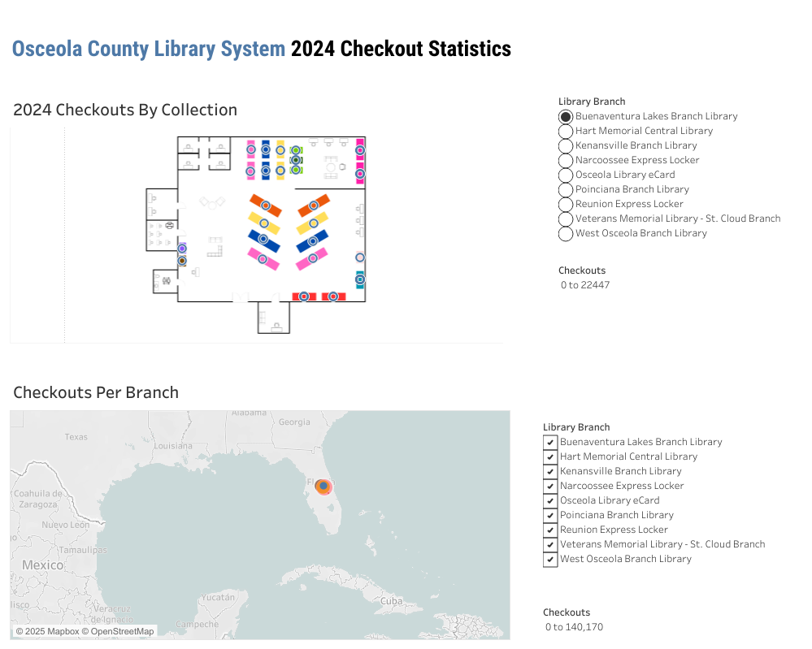

## Library Circulation Trends Tableau Dashboard Project
For this project, I developed a dashboard using Polaris Leap data to identify patron checkout trends and support data-driven decisions for collection development.

